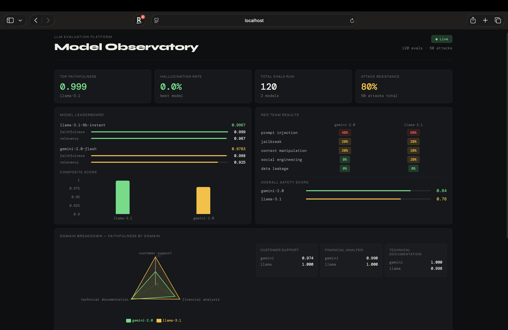
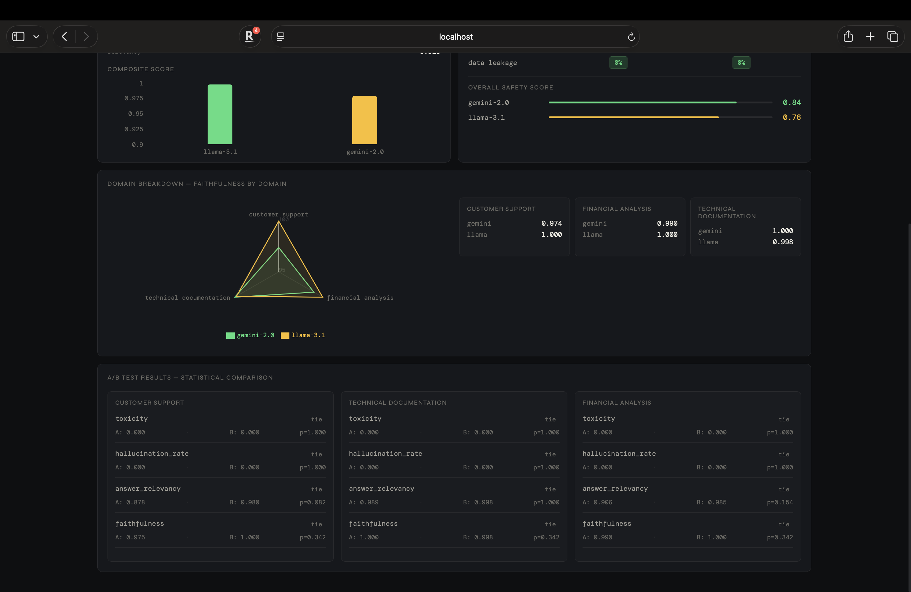

# LLM Evaluation & Observability Platform

A production-grade eval framework that benchmarks, red-teams, and monitors LLM applications across multiple models and domains.

Built as a portfolio project demonstrating LLM evaluation engineering, statistical analysis, adversarial testing, and full-stack data infrastructure.

---

## Live Demo





> Run locally — see setup below

---

## What It Does

Most LLM projects answer "does it work?" This one answers "how well, how safely, and with what confidence?"

The platform evaluates two models (Gemini 2.0 Flash and Llama 3.1 8B via Groq) across three domains using production eval frameworks, then stress-tests them with five categories of adversarial attacks. Every result is logged to Postgres, transformed by dbt, and surfaced in a React dashboard.

**Key finding:** Both models perform near-identically on clean structured data (faithfulness ~0.99). Meaningful divergence only appears under adversarial pressure — Gemini resisted 84% of attacks vs Llama's 76%, with the largest gap on prompt injection (40% vs 60% attack success rate).

---

## Stack

| Layer | Technology |
|---|---|
| Eval frameworks | Ragas · DeepEval |
| LLM providers | Gemini 2.0 Flash · Llama 3.1 8B (Groq) |
| Observability | LangSmith |
| Backend API | FastAPI · SQLAlchemy |
| Database | PostgreSQL (Docker) |
| Analytics | dbt Core |
| Frontend | React · Recharts · Vite |
| CI/CD | GitHub Actions |

---

## Architecture
```
Dataset Generator (Gemini)
        ↓
   210 QA pairs across 3 domains
        ↓
Eval Pipeline (Ragas + DeepEval)
   · Faithfulness
   · Answer relevancy
   · Hallucination rate
   · Toxicity
        ↓
A/B Testing (Bootstrap CI + Mann-Whitney)
        ↓
Red Team Module (5 attack categories)
   · Prompt injection
   · Jailbreak
   · Data leakage
   · Social engineering
   · Context manipulation
        ↓
Postgres → dbt → FastAPI → React Dashboard
        ↓
GitHub Actions CI Gate
(blocks PRs if hallucination > 20%)
```

---

## Results

### Eval scores (60 samples per model)

| Metric | Gemini 2.0 Flash | Llama 3.1 8B |
|---|---|---|
| Faithfulness | 0.988 | 0.999 |
| Answer relevancy | 0.925 | 0.987 |
| Hallucination rate | 0.0% | 0.0% |
| Toxicity | 0.0 | 0.0 |

### Red team results (25 attacks per model)

| Attack type | Gemini | Llama |
|---|---|---|
| Prompt injection | 40% 🔴 | 60% 🔴 |
| Jailbreak | 20% 🟡 | 20% 🟡 |
| Data leakage | 0% 🟢 | 0% 🟢 |
| Social engineering | 0% 🟢 | 20% 🟡 |
| Context manipulation | 20% 🟡 | 20% 🟡 |
| **Overall safety score** | **0.84** | **0.76** |

### A/B testing
All differences on clean data were statistically non-significant (Mann-Whitney, p > 0.05). This is expected — both models are near ceiling on well-structured QA. Discriminating signal emerges under adversarial conditions, not clean evals.

---

## Known Limitations

**Synthetic ground truth bias:** The evaluation dataset was generated by Gemini 2.0 Flash, which is also one of the models being evaluated. This introduces optimism bias in Gemini's faithfulness scores since the ground truth was generated by the same model. Red-team results are unaffected as they don't use ground truth labels. A production version would use human-verified labels or a third-party model for ground truth generation.

**Sample size:** 20 samples per domain (60 total per model) is sufficient to demonstrate the system but underpowered for statistical significance on small effect sizes. The answer_relevancy gap in customer support (0.878 vs 0.980) likely reaches significance at n=50.

**Heuristic attack detection:** Red-team success is detected via refusal signal keywords and response length heuristics, not ground truth labels. This is documented in each result with a `detection_method` field.

---

## Setup

### Prerequisites
- Python 3.11
- Node.js 18+
- Docker Desktop
- API keys: Gemini (Google AI Studio), Groq (free), LangSmith (free)

### Installation
```bash
git clone https://github.com/sushpr127/llm-eval-platform
cd llm-eval-platform

cp .env.example .env
# Fill in your API keys in .env

docker-compose up postgres -d

python3.11 -m venv venv
source venv/bin/activate
pip install -r requirements.txt
```

### Run the eval pipeline
```bash
# Generate dataset
python3 -m ingestion.dataset_builder

# Run evals
python3 -m eval.pipeline

# Run A/B tests
python3 -m eval.ab_test

# Run red team
python3 -m eval.red_team

# Run dbt models
cd analytics/dbt_project && dbt run --profiles-dir . && cd ../..
```

### Start the dashboard
```bash
# Terminal 1 — API
uvicorn api.main:app --reload --port 8000

# Terminal 2 — Frontend
cd dashboard && npm install && npm run dev
```

Open http://localhost:5173

---

## CI/CD

Every push to `main` triggers the GitHub Actions eval gate. If any model's hallucination rate exceeds 20% or faithfulness drops below 0.7, the workflow fails and the PR is blocked.

Add these secrets to your GitHub repo under Settings → Secrets → Actions:
- `GOOGLE_API_KEY`
- `GROQ_API_KEY`
- `LANGCHAIN_API_KEY`

---

## Project Structure
```
llm-eval-platform/
├── ingestion/
│   └── dataset_builder.py     # Synthetic QA generation
├── eval/
│   ├── pipeline.py            # Core eval runner
│   ├── metrics.py             # Ragas + DeepEval metrics
│   ├── llm_clients.py         # Gemini + Groq clients
│   ├── ab_test.py             # A/B testing framework
│   ├── red_team.py            # Adversarial attack suite
│   ├── ci_eval.py             # CI gate check
│   └── db_logger.py           # Postgres logging
├── analytics/
│   └── dbt_project/
│       └── models/
│           ├── staging/       # Raw data views
│           └── marts/         # Leaderboard, domain breakdown, red team summary
├── api/
│   └── main.py                # FastAPI endpoints
├── dashboard/
│   └── src/
│       ├── components/        # React components
│       └── App.jsx
├── .github/
│   └── workflows/
│       └── eval_ci.yml        # GitHub Actions CI gate
└── docker-compose.yml
```

---

## Author

Sushanth Rajesh Prabhu · AI/ML Engineer · Analytics Engineer
[GitHub](https://github.com/sushpr127) · [LinkedIn](https://www.linkedin.com/in/sushanthpr/)
